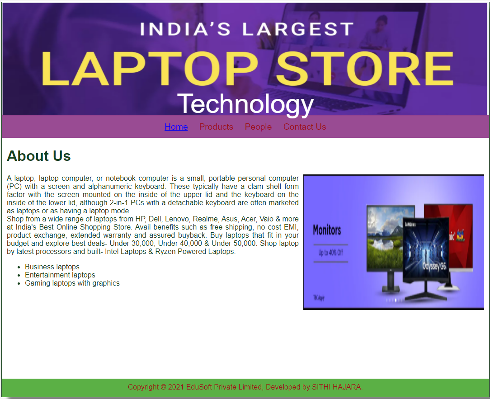
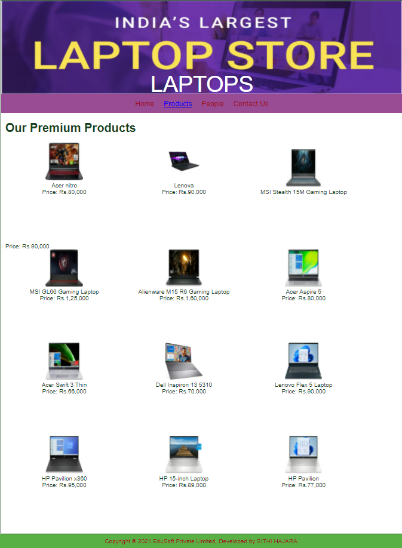
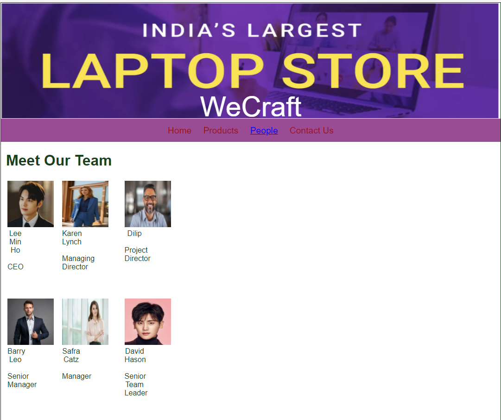
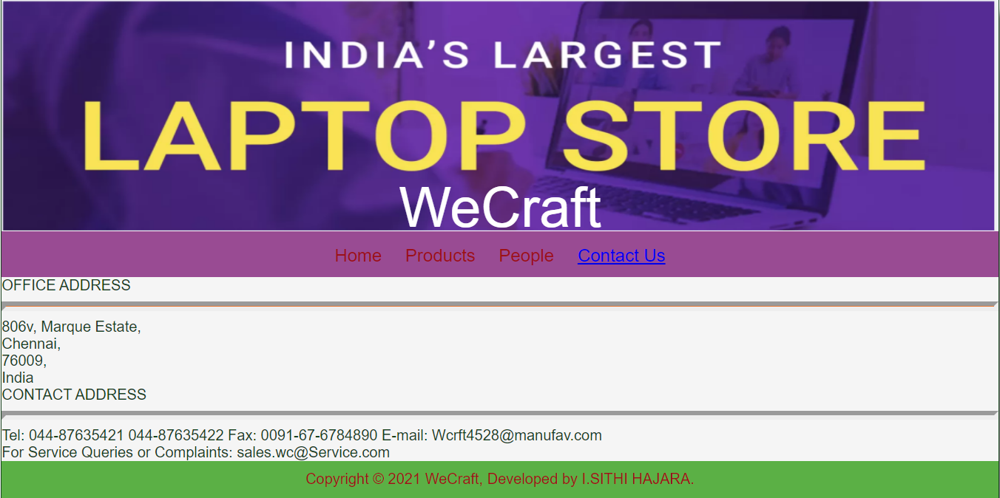

# Web Design for a Software Product Company

## AIM:

To design a static website for a software product company company.

## DESIGN STEPS:

### Step 1:

Requirement collection.

### Step 2:

Creating the layout using HTML and CSS.

### Step 3:

Updating the sample content.

### Step 4:

Choose the appropriate style and color scheme.

### Step 5:

Validate the layout in various browsers.

### Step 6:

Validate the HTML code.

### Step 6:

Publish the website in the given URL.

## PROGRAM :
1.HOME PAGE
```
<!DOCTYPE html>
<html lang="en">
  <head>
    <title>EduSoft Private Limited</title>
    <link rel="stylesheet" href="./css/layout.css" />
    <link rel="icon" href="./img/icon.png" type="image/x-icon" />
  </head>

  <body>
    <div class="container">
      <div class="banner">Technology</div>
      <div class="menu">
        <div class="menuitemselected"><a href="/static/home.html">Home</a></div>
        <div class="menuitem"><a href="/static/products.html">Products</a></div>
        <div class="menuitem"><a>People</a></div>
        <div class="menuitem"><a>Contact Us</a></div>
      </div>
      <div class="content">
        <div class="homecontent">
          <h1>About Us</h1>
          
          <div class="contenttext">
            A laptop, laptop computer, or notebook computer is a small, portable personal computer (PC) with a screen and alphanumeric keyboard.
             These typically have a clam shell form factor with the screen mounted on the inside of the upper lid and the keyboard on the inside of the lower lid, although 2-in-1 PCs with a detachable keyboard are often marketed as laptops or as having a laptop mode.
             


            <br />

            Shop from a wide range of laptops from HP, Dell, Lenovo, Realme, Asus, Acer, Vaio & more at India's Best Online Shopping Store. 
            Avail benefits such as free shipping, no cost EMI, product exchange, extended warranty and assured buyback.
             Buy laptops that fit in your budget and explore best deals- Under 30,000, Under 40,000 & Under 50,000.
              Shop laptop by latest processors and built- Intel Laptops & Ryzen Powered Laptops.


            <ul>
              <li>Business laptops</li>
              <li>Entertainment laptops</li>
              <li>Gaming laptops with graphics</li>
            </ul>
          </div>
        </div>
      </div>
      <div class="footer">
        Copyright &#169; 2021 EduSoft Private Limited, Developed by SITHI HAJARA.
      </div>
    </div>
  </body>
</html>
```
2.PRODUCT PAGE


```
<!DOCTYPE html>
<html lang="en">
  <head>
    <title>EduSoft Private Limited</title>
    <link rel="stylesheet" href="./css/layout.css" />
    <link rel="icon" href="./img/icon.png" type="image/x-icon" />
  </head>

  <body>
    <div class="container">
      <div class="banner">LAPTOPS</div>
      <div class="menu">
        <div class="menuitem"><a href="/static/home.html">Home</a></div>
        <div class="menuitemselected">
          <a href="/static/products.html">Products</a>
        </div>
        <div class="menuitem"><a>People</a></div>
        <div class="menuitem"><a>Contact Us</a></div>
      </div>
      <div class="content">
        <div class="productcontent">    
          <h1>Our Premium Products</h1>
          <div class="productitems">
              <div class="productitem"> 
                  <div class="itemimage">
                  
                  </div>
                  <div class="itemname">Acer nitro</div>
                  <div class="itemprice">Price: Rs.80,000 </div>
              </div>
              <div class="productitem"> 
                  <div class="itemimage">
                  
                  </div>
                  <div class="itemname">Lenova</div>
                  <div class="itemprice">Price: Rs.90,000 </div>
              </div>
              <div class="productitem"> 
                <div class="itemimage">
                
                </div>
                <div class="itemname">MSI Stealth 15M Gaming Laptop</div>
                </div>
                <div class="itemprice">Price: Rs.90,000 </div>
            </div>
            <div class="productitem"> 
              <div class="itemimage">
              
              </div>
              <div class="itemname">MSI GL66 Gaming Laptop</div>
              <div class="itemprice">Price: Rs.1,25,000 </div>
          </div>
          <div class="productitem"> 
            <div class="itemimage">
            
            </div>
            <div class="itemname">Alienware M15 R6 Gaming Laptop</div>
            <div class="itemprice">Price: Rs.1,60,000 </div>
        </div>
        <div class="productitem"> 
          <div class="itemimage">
          
          </div>
          <div class="itemname">Acer Aspire 5</div>
          <div class="itemprice">Price: Rs.80,000 </div>
      </div>
      <div class="productitem"> 
        <div class="itemimage">
        
        </div>
        <div class="itemname">Acer Swift 3 Thin</div>
        <div class="itemprice">Price: Rs.66,000 </div>
    </div>
    <div class="productitem"> 
      <div class="itemimage">
      
      </div>
      <div class="itemname">Dell Inspiron 13 5310</div>
      <div class="itemprice">Price: Rs.70,000 </div>
  </div>
  <div class="productitem"> 
    <div class="itemimage">
    
    </div>
    <div class="itemname">Lenovo Flex 5 Laptop</div>
    <div class="itemprice">Price: Rs.90,000 </div>
</div>
<div class="productitem"> 
  <div class="itemimage">
  
  </div>
  <div class="itemname">HP Pavilion x360</div>
  <div class="itemprice">Price: Rs.95,000 </div>
</div>
<div class="productitem"> 
  <div class="itemimage">
  
  </div>
  <div class="itemname">HP 15-inch Laptop</div>
  <div class="itemprice">Price: Rs.89,000 </div>
</div>
<div class="productitem"> 
  <div class="itemimage">
  
  </div>
  <div class="itemname">HP Pavilion</div>
  <div class="itemprice">Price: Rs.77,000 </div>
</div>
          </div>
          </div>        
      </div>
      <div class="footer">
        Copyright &#169; 2021 EduSoft Private Limited, Developed by SITHI HAJARA.
      </div>
    </div>
  </body>
</html>
```

3.PEOPLE PAGE
```
<!DOCTYPE html>
<html lang="en">
  <head>
    <title>WeCraft</title>
    <link rel="stylesheet" href="./css/layout.css" />
    <link rel="icon" href="./img/icon.png" type="image/x-icon" />
  </head>

  <body>
    <div class="container">
      <div class="banner">WeCraft</div>
      <div class="menu">
        <div class="menuitem"><a href="/static/home.html">Home</a></div>
        <div class="menuitem">
          <a href="/static/products.html">Products</a>
        </div>
        <div class="menuitemselected"><a href="/static/people.html">People</a></div>
        <div class="menuitem"><a>Contact Us</a></div>
      </div>
      <div class="content">
        <div class="productcontent">    
          <h1>Meet Our Team</h1>
          <table>
            <tr> 
            <td>
              <div class="productitem"> 
                  <div class="itemimage">
                  
                  </div>
                  <div class="itemname">Lee Min Ho</div> <br>
                  <div class="itemprice"> CEO  </div> 
                </td>
            <td>
                <div class="productitem"> 
                    <div class="itemimage">
                    
                    </div>
                    <div class="itemname"> Karen Lynch </div> <br>
                    <div class="itemprice">Managing Director</div>
                </td>
                <td>
                    <div class="productitem"> 
                        <div class="itemimage">
                        
                        </div>
                        <div class="itemname">Dilip</div> <br>
                        <div class="itemprice">Project Director</div>

                </td>  
            </tr>
            <tr>
                <td>
                    <div class="productitem"> 
                        <div class="itemimage">
                        
                        </div>
                        <div class="itemname">Barry Leo</div> <br>
                        <div class="itemprice">Senior Manager</div>
                    </td>
                    <td>
                        <div class="productitem"> 
                            <div class="itemimage">
                            
                            </div>
                            <div class="itemname">Safra Catz</div><br>
                            <div class="itemprice"> Manager</div>

                    </td>
                    <td>
                        <div class="productitem"> 
                            <div class="itemimage">
                            
                            </div>
                            <div class="itemname">David Hason</div> <br>
                            <div class="itemprice">Senior Team Leader</div>
                    </td>

            </tr>    
            </table>
            </div>
            </div>
        </body>
        </html>
```

4.CONTACT PAGE
```
<!DOCTYPE html>
<html lang="en">
  <head>
    <title>WeCraft</title>
    <link rel="stylesheet" href="./css/layout.css" />
    <link rel="icon" href="./img/icon.png" type="image/x-icon" />
  </head>

  <body>
    <div class="container">
      <div class="banner">WeCraft</div>
      <div class="menu">
        <div class="menuitem"><a href="/static/home.html">Home</a></div>
        <div class="menuitem">
          <a href="/static/products.html">Products</a>
        </div>
        <div class="menuitem"><a href="/static/people.html">People</a></div>
        <div class="menuitemselected"><a href="/static/contactus.html">Contact Us</a></div>
      </div>
      <div class="contactus" background-image="url(/static/img/cbg.jpg")>
          OFFICE ADDRESS <br>
          <hr style="height:2px;border-width:5px;color:#e6752f;background-color: #e6752f">
          
          806v, 
          Marque Estate,<br>
          Chennai,<br>
          76009,<br>
          India<br>

          CONTACT ADDRESS<br>
          <hr style="height:2px;border-width:5px;color:#e6752f;background-color: #e6752f">
          
          Tel: 044-87635421
               044-87635422
          Fax: 0091-67-6784890
          E-mail: Wcrft4528@manufav.com
          <br>
           For Service Queries or Complaints: sales.wc@Service.com
        
        </div>
        <div class="footer">
            Copyright &#169; 2021 WeCraft, Developed by I.SITHI HAJARA.
          </div>

      </div>
      </body>
      </html>
      ```
```      
## OUTPUT:

### Home Page:



### PRODUCT PAGE:



### PEOPLE PAGE:



### CONTACT US PAGE:



## Result:

Thus a website is designed for the software product company and the HTML,CSS code are validated.
